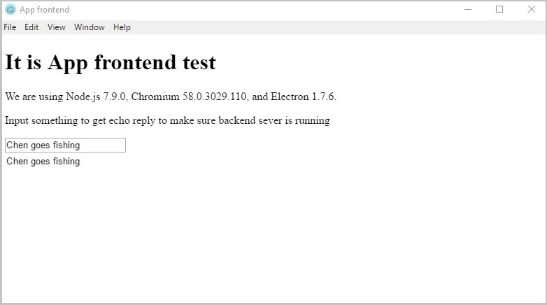

# Electron GUI Python Server App
This repo contains a template for making your own python-backend + js-frontend app.  

The code uses `zerorpc` inter-process communcation python package that allows this setup to run python-powered backend (that can be used e.g. machine learning or image processing) and flexible electron-powered UI.  
This code is an adaptation of [this](https://www.fyears.org/2017/02/electron-as-gui-of-python-apps-updated.html) post, but unlike the initial app, my python server has it's own inner state and loop, therefore it can call the fontend by itself, successfully processing long queues (such as heavy image processing). The class architechteure was also changed.  



# Architecture
Simplified version of the architecture is provided below. It comprises of the python App class that incorporates both server that processes the AppAPI calls and the client that sends the App.run() loop commands to the frontend.  
```text
start()
 |
 V
+--------------------+
|                    | start()
|                    +-------------> +----------------------+
|                    |               |                      |
|      electron      |               |        python        |
| (all html/css/js)  |               |   (all processing)   |
|                    |               |                      |
|                    |               |                      |
|              input | ------------> | [AppAPI]             |
|                    |               |    ^                 |
|                    |               |    |                 |
|                    |               |    v                 |
|      server_api.js | <------------ |  [App] <— App.run()  |
|                    |               |                      |
+--------------------+               +----------------------+
```

### Preparation
Tested with:
* Ubuntu 16.04
* Node 7.9.0
* npm
* Python 3.5

First, you install python packages:
```text
pip install zerorpc
pip install pyinstaller
```

Then you clean the electron and node cache:
```text
rm -rf ~/.node-gyp
rm -rf ~/.electron-gyp
rm -rf ./node_modules
```

Then install electron to the project using npm:
```text
npm install --runtime=electron --target=1.7.6
```

### Running
To run the app simply execute:
```text
./node_modules/.bin/electron .
```

When you need to reinstall electron (do it if everything is supposed to work, but it does not), run:
```text
./0_reinstall_electron.sh
```